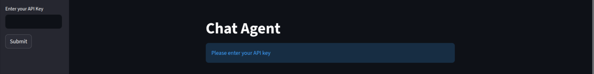
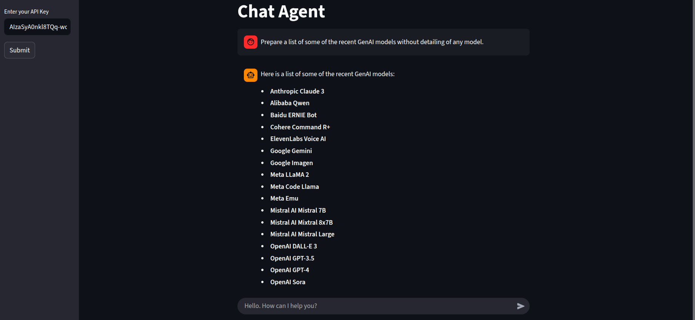
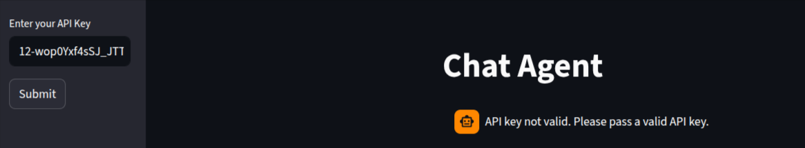

# 🗣️ Chatbot

A **Chatbot** agent, using google Gemini API and Streamlit.  

---

## 📘 Features

- Reads input from the user.  
- Outputs the response from the Google API.

## ⚙️ How to Run

### 1. Clone the Repository
```
$ git clone https://github.com/pandyahariom/ai-chatbot.git
```

### 2.Set Up the Virtual Environment
```
$ python3 -m venv ai
$ source ai/bin/activate
```

### 3.Install the dependencies
```
$ pip install -r requirements.txt
```

### 4.Execute the code
```
$ streamlit run chat_agent.py
```
### 5.Visit the following URL in your browser to see the output
```
$ http://localhost:8501
```

## 🖼️ Expected Output

  Below is an example of how the Chat Agent looks when running in your browser (localhost):

  #### 1. Initial Screen
  

  #### 2. Conversation 
  

  #### 3. Error Handling
  
  


